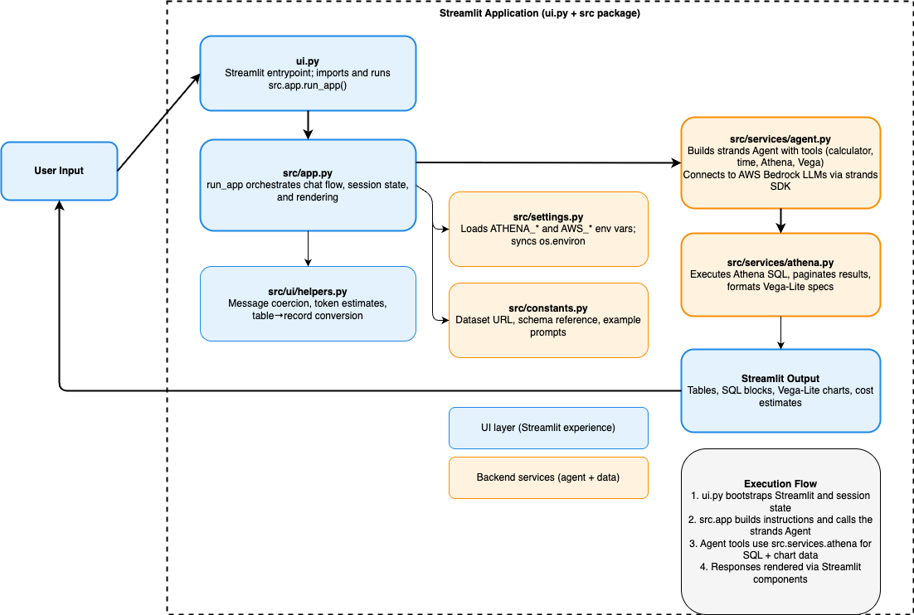

# GenAI InsightPilot Explorer

GenAI InsightPilot Explorer is a Streamlit experience for conversational analytics powered by Strands’ agentic tooling and Amazon Athena. Describe the insight you want, and the agent crafts SQL, runs it in Athena, and streams back data, charts, and token-cost estimates—all inside a chat-style UI.

## Highlights
- 🎯 **Goal:** Natural-language questions → verifiable data-backed answers.
- 🧠 **Agent runtime:** Strands Agent instrumented with calculator, time, Athena, and Vega-Lite tools.
- 🛠️ **Stack:** Streamlit UI (`ui.py` + `src/` package), Strands SDK, boto3-powered Athena helpers.
- 📊 **User experience:**
  - Sidebar schema reference and starter prompts.
  - Live status while the agent thinks and runs SQL.
  - Inline SQL preview, Athena results table, optional Vega-Lite chart.
  - Token + cost estimation for transparency.
  - Session history so answers, charts, and SQL stay visible.

## Project Structure
- `ui.py` — Streamlit entrypoint; delegates to the modular app package.
- `src/app.py` — Orchestrates chat flow, session state, and rendering.
- `src/ui/helpers.py` — Formatting helpers for agent output and tables.
- `src/settings.py` — Loads/synchronises AWS + Athena environment settings.
- `src/services/agent.py` — Builds the Strands Agent with registered tools.
- `src/services/athena.py` — Athena SQL execution + Vega-Lite spec builder.
- `src/constants.py` — Dataset metadata, schema description, and sample prompts.

## Architecture Overview


The diagram highlights the separation between the Streamlit-facing UI (blue) and backend/agent services (orange), plus the flow of prompts, SQL generation, and rendered responses.

## Getting Started
1. Install dependencies: `pip install -r requirements.txt`
2. Export the required settings (typical env vars):
   ```bash
   export AWS_REGION=us-east-1
   export ATHENA_DATABASE=super_store_data
   # Optional: ATHENA_WORKGROUP, ATHENA_OUTPUT, ATHENA_CATALOG
   ```
3. Launch the app: `streamlit run ui.py`
4. Ask natural-language questions about the Superstore dataset from the chat input.

### Updating the Diagram
Edit `architecture.drawio` in diagrams.net (or the VS Code Draw.io extension), then run:
```bash
python3 scripts/render_architecture.py
```
to regenerate `architecture.png`. (The README references the PNG so it stays up to date for viewers outside the repository.)

Perfect for showcasing GenAI-assisted BI workflows or experimenting with agentic data exploration patterns.
